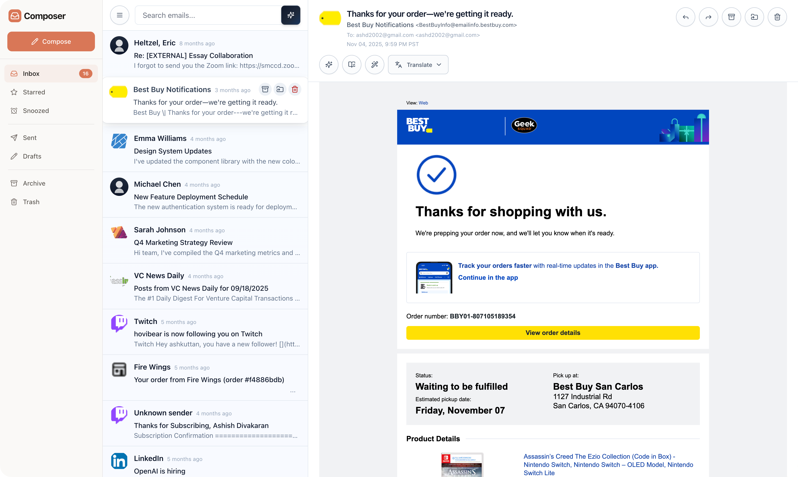

# Composer

[](https://composer.email)

Composer is an experimental email client exploring what is possible when AI is well integrated into everyday software. The vision was to build and test features that are not just a chatbot sidebar, but tooling that anticipates what you might need before you ask for it.

## Why this exists

Most AI integrations are reactive: open a panel, write a prompt, wait, copy-paste. Composer anticipates that quietly by analyzing the data and UI in the current context and surfaces actions [it believes] you're likely to take next.

- **Anticipatory suggestions** — Select an email and the app surfaces contextual actions (summarize, draft reply, flag follow-up) without prompting.
- **One-click depth** — Summarize, translate, adjust tone, or draft replies. The AI sees the full thread and adapts to who you're replying to.
- **Batch operations** — Triage dozens of messages at once. Auto-label by intent, merge duplicates, collapse noise.
- **Streaming responses** — Token-by-token output with visible "thinking" states so you're never staring at a spinner.

## Web and mobile

The desktop web app has floating windows, aiming to behave like a native OS app, and the mobile interface has full-screen views and bottom drawers with the same capabilities.

## Tech stack

Spring Boot 3 (Java 25) · Svelte 5 + Vite · OpenAI-compatible LLM providers · Optional Qdrant vector search

## Quick start

Requires JDK 25 and Node 22.17.0 (use `nvm use` to load the pinned version from `.nvmrc`).

```bash
export OPENAI_API_KEY="..."
make dev
```

Open `http://localhost:5183/app/email-client/`. Sample emails live in `data/eml/`.

For production builds, alternative providers (OpenRouter, Ollama), and vector search setup, see [docs/getting-started.md](docs/getting-started.md).

## Documentation

- [Getting Started](docs/getting-started.md) – setup, configuration, development workflow
- [Architecture](docs/00-architectural-entrypoint.md) – system design, file inventory, extension points
- [Email Client](docs/email-client-v2.md) – frontend architecture, window system, email safety model
- [Context & Conversations](docs/email-context-conversation-uuids.md) – how identifiers flow between UI and API

## Contributing

See [`CONTRIBUTING.md`](CONTRIBUTING.md).

## License

See [`LICENSE.md`](LICENSE.md). Copyright © 2026 William Callahan.

## [Other projects from William Callahan](https://williamcallahan.com/projects)

- [Apple-Maps-Java](https://github.com/WilliamAGH/apple-maps-java) - Library for adding free Apple Maps API access to your Java and Kotlin apps
- [Java Chat](https://javachat.ai) [(GitHub)](https://github.com/WilliamAGH/java-chat) - Learn programming with AI and access to a library of knowledge on the language
- [TUI4J](https://github.com/WilliamAGH/tui4j) - Library to build beautiful terminal applications in Java and Kotlin
- [Brief](https://github.com/WilliamAGH/brief) - Modern terminal application for AI chat with built-in tool calling
